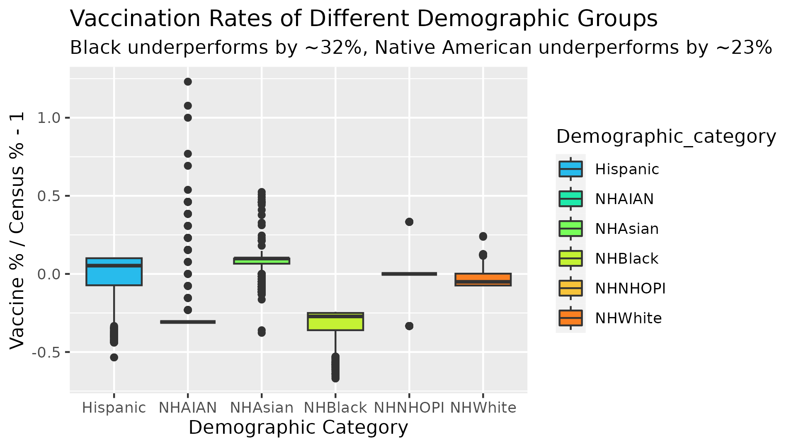

# Analysis of the effect of Demographic group vs Vaccination Rate

There have been many anectodal claims in the media that certain demographic groups are less likely to be vaccinated than others. I wanted to see if this was supported by data.

In order to do this, I decided to use the makeup of currently vaccinated people, and compare that to the makeup of this country. If the demographic percentages of vaccinated people were comparable to the demographic percentages of the census, than this would be considered false. The alternative hypothesis would be if the percentages of vaccinated people were different than the percentages in the census, then the claims the media makes may have some merit.

I first checked to see if the vaccinated % were different than census data. Using a one-way t-test, I found that all groups differed significantly from their census population percentages.

|                                    | Hispanic | AIAN/Native American | Asian | Black | NHOPI/Pacific Islander | White |
|-----------|-----------|-----------|-----------|-----------|-----------|-----------|
| Census %                           | 18.9%    | 1.3%                 | 6.1%  | 13.6% | 0.3%                   | 59.3% |
| Average Vaccine PopulationMakeup % | 18.5%    | 1.0%                 | 6.6%  | 9.3%% | 0.29%                  | 57.8% |
| Performance                        | -2%      | -23%                 | 8%    | -32%  | -2%                    | -3%   |

Asian Americans were one of the few groups that consistantly made up a larger percentage of the vaccination groups than the census data would show, with an 8% overperformance.

Most other groups underperformed their census data, but since its only by 2-3% there may not be a real world isue. However, Black Americans and Native Americans underperformed by over 3%, with 32% and 23% underperformance respectively.

Unfortunately, it appears that the anecdotal evidence presented by the media did have some truth to it. It does appear that black and native americans both have poorer vaccination rates than the general public. Considering both groups are historically marginalized, more work needs to be done to assist these groups and educate about he safety of the vaccines.

One flaw with the dataset, and the study as a whole, is that 33% of americans did not report their demographic data. For all we know, this may be where the majority of black and native americans are located. Since both of these groups are marginalized and do not trust the government for various reasons (Tuskagee, etc ), this is not a far-fetched hypothesis.
